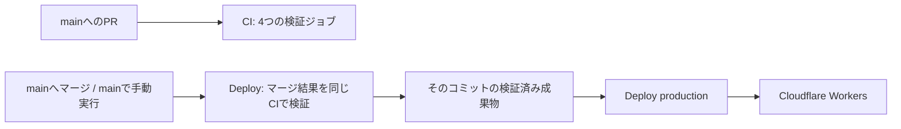

# CI/CDとCloudflare Workersへのデプロイ

GitHub Actionsの[CI](../.github/workflows/ci.yml)と[Deploy](../.github/workflows/cd.yml)で検証と本番デプロイを行う。公開対象はReact／Viteの`apps/web/dist`で、Cloudflare WorkersのStatic Assetsとして配信する。

## 実行の流れ

mainを対象とするPull Requestの作成・更新・再オープン・レビュー準備完了でCIを動かす。ドラフトPRも検証し、同じPRの古い実行は新しい更新でキャンセルする。ブランチへのpushだけではCIを起動しない。

mainへのマージ後はpushイベントでDeployが動き、再利用可能なCIワークフローでマージ後のコミットを検証する。4つのCIジョブがすべて成功した後に本番へデプロイする。他ブランチへのpushでは起動しない。Actions画面のRun workflowから手動実行もできるが、main以外を選ぶと検証・デプロイともスキップする。



| ジョブ | 実施内容 |
| --- | --- |
| `Static checks` | Biome、workspace全体のTypeScript、actionlint、ShellCheck、Nix flakeの評価・整形 |
| `Secret scan` | BetterleaksによるGit履歴全体とcheckoutのスキャン、追跡済みローカル環境ファイルの拒否、検出動作のテスト |
| `Dependency audit` | 開発・本番・optional依存のpnpm audit。low以上の既知の脆弱性と通信エラーで失敗 |
| `Tests and build` | ユニットテスト、FTO状態／逆手順の検証、本番ビルド、Wrangler dry run、PC／スマホ幅のE2E、ビルド成果物のシークレットスキャン |
| `Deploy production` | 同じ実行・コミットの検証済み成果物を取得してWranglerでデプロイ |

E2EはViteの本番previewとWranglerのローカルWorkersランタイムの両方で行う。後者ではSPAの深いURLへの直接アクセスも確認する。どちらもビルド済みアセットを使用する。

CIはChrome系の実行ライブラリが導入済みのGitHubホストランナー`ubuntu-24.04`を使用する。Playwrightのブラウザ導入は`install --only-shell chromium`で固定版の本体だけを取得し、`--with-deps`によるapt更新を行わない。Ubuntuミラーの応答待ちでジョブ全体が止まるのを避けるため、ブラウザ導入と各E2Eステップの上限はそれぞれ5分、テスト・ビルドジョブ全体は20分に設定する。セルフホストのLinuxランナーへ変更する場合は、必要なOSライブラリをランナー側で準備する。[Ubuntuランナーの構成](https://github.com/actions/runner-images/blob/main/images/ubuntu/Ubuntu2404-Readme.md)、[Playwrightのブラウザ導入](https://playwright.dev/docs/browsers)

Deployの検証ステージでmainのコミットをビルドし、デプロイステージはビルドし直さず同じ実行の`web-dist-<commit SHA>`を使用する。PRの成果物を本番公開に流用しない。検証が失敗・キャンセルされた場合はデプロイを実行しない。PRや`main`以外のブランチには本番デプロイの条件が成立しない。

## Dependabot

[Dependabot設定](../.github/dependabot.yml)は[coffeelogの設定](https://github.com/yahatapp/coffeelog/blob/main/.github/dependabot.yml)を参考に、毎週月曜09:00（Asia/Tokyo）にnpm依存とGitHub Actionsを確認する。npmはルートのworkspace共通lockfileを対象にする。

- npmのminor／patch更新は本番依存と開発依存でグループ化し、major更新は個別PRにする。未マージPRの上限は10件。
- `@types/node`のmajor更新は除外し、Nodeランタイム更新時に合わせて変更する。
- GitHub Actionsは共通セットアップのActionも含めてグループ化する。未マージPRの上限は5件。コミットSHAによる固定を維持する。
- 更新PRも通常のPRと同じCIを受け、mainへのマージ後にDeployが動く。

pnpmのバージョンとNix側の配布ハッシュ、Nodeの`devEngines.runtime`、Nixpkgsの更新は[開発環境の手順](DEVELOPMENT_ENVIRONMENT.md)で行う。Dependabotによるpnpm 11 workspaceの実更新はGitHub側の更新ログと`--frozen-lockfile`のCI結果で確認する。GitHubの[対応バージョン表](https://docs.github.com/en/code-security/reference/supply-chain-security/dependabot-options-reference#package-ecosystem)は現時点でpnpm 10までを記載しているため、更新ジョブが失敗する場合もプロジェクトの固定バージョンを変更せず、Nix環境で手動更新する。

今回のauditでは間接依存の`undici@7.29.0`と`source-map-js@1.2.1`から11件を検出した。[pnpm-workspace.yaml](../pnpm-workspace.yaml)のバージョン指定付きoverrideで、それぞれ修正版の`7.29.1`と`1.2.2`に固定してlockfileを更新した。再監査の検出は0件。上流依存の更新で元のバージョンが不要になったらoverrideも削除する。[undiciの修正情報](https://github.com/advisories/GHSA-rfgv-xxqx-mfg5)、[source-map-jsの修正情報](https://github.com/advisories/GHSA-68fv-2mgg-jv7q)

CIとDeployには[coffeelogのワークフロー](https://github.com/yahatapp/coffeelog/tree/main/.github/workflows)のPRイベント・実行制御・Nixキャッシュを取り入れている。FTO生成器の状態検証、Workers配信のE2E、本番・開発依存を含むaudit、マージ結果の再検証はこのプロジェクトの要件として実行する。

## 初回に必要なGitHub／Cloudflare設定

### 1. GitHubリポジトリ

このプロジェクトをGitHubリポジトリへ接続し、ワークフローとlockfileを含めてpushする。GitHub Actionsを有効にし、本番ブランチ名を`main`にする。別名を採用する場合は両ワークフローのブランチ条件も変更する。

### 2. CloudflareアカウントとAPIトークン

CloudflareアカウントのWorkers & Pagesで`workers.dev`のサブドメインを設定し、対象アカウントのAccount IDを確認する。初期公開先は`everyday-nautilus.<サブドメイン>.workers.dev`。独自ドメインは別途設定する。

CloudflareのAPI Tokensで、対象アカウントに限定したデプロイ用APIトークンを作成する。Static Assetsの公開には`Account / Workers Scripts / Edit`権限を使用する。[アセット公開APIの必要権限](https://developers.cloudflare.com/api/resources/workers/subresources/scripts/subresources/assets/subresources/upload/methods/create/)

アカウントIDはWranglerへ明示する。[WorkersのGitHub Actions連携](https://developers.cloudflare.com/workers/ci-cd/external-cicd/github-actions/)

### 3. GitHubのproduction環境

GitHubリポジトリの**Settings → Environments → New environment**で`production`を作成する。

- Deployment branches and tagsを`main`に限定する。
- Environment secretsに次の2項目を登録する。
- 自動CDとして使う初期構成では、Required reviewersを設定する必要はない。

| Environment secret | 値 |
| --- | --- |
| `CLOUDFLARE_API_TOKEN` | 対象アカウントへのデプロイ権限を持つAPIトークン |
| `CLOUDFLARE_ACCOUNT_ID` | デプロイ先のCloudflare Account ID |

GitHub CLIを利用する場合、対象リポジトリのディレクトリで次を実行し、プロンプトへ入力する。

```sh
gh secret set CLOUDFLARE_API_TOKEN --env production
gh secret set CLOUDFLARE_ACCOUNT_ID --env production
```

トークンはコード・`.env`・フロントエンドの`VITE_*`変数に入れない。Actionsではデプロイを行うステップだけに渡す。未設定の場合、CDは設定項目を示して失敗する。

### 4. 初回実行

ブランチからmainへのPRを作り、CI成功後にマージする。ActionsのDeployでマージ結果の検証と公開を確認する。Wranglerのログで公開URLとVersion IDを確認し、実際の公開URLでFTO生成と`X-Robots-Tag`を確認する。

mainのRuleset／branch protectionでPR経由の更新を必須にし、`Static checks`・`Secret scan`・`Dependency audit`・`Tests and build`を必須チェックにする。pushイベントは直接pushでも発生するため、マージだけを許可する運用はこのブランチ保護で保証する。

## Workers設定

[wrangler.jsonc](../wrangler.jsonc)が配信設定の基準になる。

- 本番環境：`production`、Worker名：`everyday-nautilus`。
- `assets.directory`：`./apps/web/dist`。
- `assets.not_found_handling`：`single-page-application`。
- `compatibility_date`：`2026-09-26`。
- 初期公開は`workers.dev`、バージョンごとのpreview URLは無効。
- Observabilityを有効化。

現時点では独自のサーバー処理やbindingsを持たないStatic Assetsの構成。`main`のWorkerハンドラーやEnv型は不要で、ブラウザのcubing.js Workerは静的なJavaScriptとして配信する。API等を追加する際にWorkerコード・bindings・生成した型の検証を追加する。[Static Assets](https://developers.cloudflare.com/workers/static-assets/)、[SPA配信](https://developers.cloudflare.com/workers/static-assets/routing/single-page-application/)

Wranglerは開発依存に固定し、アプリのVite構成とcubing.js用ビルドアダプターを維持する。Wranglerから自動ビルドする設定は追加していない。

## ローカル検証

```sh
nix develop
pnpm install --frozen-lockfile
pnpm exec playwright install --only-shell chromium
pnpm check
pnpm verify:scrambler
pnpm deploy:dry-run
pnpm test:e2e
pnpm test:e2e:workers
```

dry runとローカルE2EにはCloudflareのAPIトークンは不要。`pnpm dev:workers`で`http://127.0.0.1:8787`にビルド済みアプリを配信する。ビルドがない場合は先に`pnpm build`を実行する。

ツールはNix環境を利用する。初回セットアップとpre-commitの仕様は[開発環境](DEVELOPMENT_ENVIRONMENT.md)を参照。

```sh
nix develop
pnpm test:repo
pnpm audit:deps
actionlint
shellcheck scripts/*.sh
nix flake check --all-systems --no-build
nix fmt -- --check flake.nix
betterleaks git . --log-opts="--all" --config=.betterleaks.toml --redact=100 --no-banner --no-color --ignore-gitleaks-allow
betterleaks dir . --config=.betterleaks.toml --redact=100 --no-banner --no-color --ignore-gitleaks-allow
```

CIは`fetch-depth: 0`で履歴を取得し、過去に追加後削除された秘密情報も検出対象にする。

## 検索エンジンのインデックス抑止

- HTMLの`meta[name="robots"]`を`noindex, nofollow, noarchive`に設定。
- `apps/web/public/_headers`から全Static Assetsレスポンスに同じ`X-Robots-Tag`を設定。
- `robots.txt`はクロールを許可し、クローラがnoindexを読み取れるようにする。`Disallow: /`でnoindexを読めなくしない。
- WorkersのE2EでルートHTML・SPAの深いURL・静的ファイルのヘッダーとHTMLのmeta指定を確認。

noindexは対応するクローラへの指示で、アクセス制限ではない。[Cloudflareのヘッダー設定](https://developers.cloudflare.com/workers/static-assets/headers/)、[Googleのnoindex仕様](https://developers.google.com/search/docs/crawling-indexing/block-indexing)

## 固定バージョンと認証情報の扱い

- GitHub ActionsはコミットSHAで固定。更新時は各リリースとSHAを確認する。
- pnpm・Git・Betterleaks・Lefthook・actionlint等は`flake.lock`で同じNixpkgsに固定。別々のダウンロード用スクリプトは使用しない。
- 共通セットアップはMagic Nix CacheでGitHub ActionsのNixストアキャッシュを使用する。FlakeHubへのアップロードは無効にし、追加のシークレットや権限は不要。
- Betterleaksは固定版の標準ルールを継承し、ログを100%マスクする。ローカル依存キャッシュ等を除外し、ソース・`.env`等・本番成果物を対象にする。インラインのallowコメントは無視する。validationは無効。
- Nodeは`package.json`の`devEngines.runtime`に24.21.0を固定し、pnpmで管理する。CIはNixでpnpmを導入し、`--frozen-lockfile`でプロジェクト用ランタイムと依存を導入する。Nodeの実行バージョンも確認する。依存ビルドは`esbuild`と`workerd`を許可する。
- Actionsの権限は`contents: read`。checkoutの認証情報をGit設定に残さない。
- 本番デプロイは同時実行せず、実行中の本番ワークフローを新しいpushでキャンセルしない。
- 検証済みアセットと失敗時のブラウザtraceは7日間保存する。ViteとWorkersのtraceは`test-results/vite`と`test-results/workers`に分け、後続テストによる削除を防ぐ。ローカルの`.wrangler`・`.dev.vars*`・ビルド成果物はGit管理から除外する。

シークレットを検出した場合、ジョブを失敗させて公開を止める。実際の漏えいは該当する認証情報を失効・再発行し、Git履歴も対処する。誤検出の除外は対象を狭く指定し、変更をレビューする。[Betterleaks](https://github.com/betterleaks/betterleaks)、[actionlint](https://github.com/rhysd/actionlint)

## 公開後の不具合

CloudflareダッシュボードのWorker → Deploymentsで、正常だったバージョンへRollbackする。修正PRをmainへマージして再度検証・公開する。[WorkersのRollback](https://developers.cloudflare.com/workers/versions-and-deployments/rollbacks/)

## 実行状況

2026-09-26のローカル検証は以下のとおり。

| 検証 | 結果 |
| --- | --- |
| lockfileに基づく依存導入 | 成功 |
| Nix環境 | Apple Siliconで構築・起動成功。Linux x64／ARM64もflake評価成功。同じツール版を確認 |
| Biome・workspace全体の型チェック・actionlint・ShellCheck・nixfmt | 成功 |
| Lefthookの登録とpre-commitの4項目 | 成功。ステージがない手動実行は`--force`を指定 |
| pnpm audit（low以上・開発／本番依存） | 既知の脆弱性なし |
| ユニットテスト | 9件成功 |
| FTO状態検証・本番ビルド・Workers dry run | 成功 |
| Vite本番previewのE2E | PC／スマホ幅の2件成功 |
| Workersローカル配信のE2E | PC／スマホ幅のFTO生成・SPA配信・noindexの6件成功 |
| ソースとビルド成果物のBetterleaksスキャン | 検出なし |
| 一時Gitリポジトリでの秘密情報と環境ファイルの検査 | ステージ済み・削除済みのダミートークンを検出し終了コード1。ログをマスク。環境ファイルの強制追加を拒否。テンプレート・削除・clean checkoutは成功 |

GitHub remoteは設定済み。今回変更したワークフローのGitHub Actions上での実行とCloudflare本番公開は未確認。上記のEnvironment secretsとブランチ保護を設定し、変更PRをマージして確認する。

coffeelogを参考にした今回の見直し後も、Nix環境でDependabot YAML、actionlint、ShellCheck、Nix flakeの評価・整形、`pnpm check`、`pnpm test:repo`、依存audit、FTO状態検証、Workers dry run、Viteの2件／Workersの6件のE2Eが成功した。BetterleaksによるGit履歴・checkout・本番成果物の検出もなし。GitHub Actionsでの実行とDependabotの更新PR作成は未確認。
