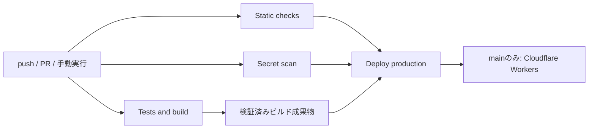

# CI/CDとCloudflare Workersへのデプロイ

GitHub Actionsの[CI / Deploy](../.github/workflows/ci.yml)で検証と本番デプロイを行う。公開対象はReact／Viteの`apps/web/dist`で、Cloudflare WorkersのStatic Assetsとして配信する。

## 実行の流れ

push、Pull Request、手動実行でCIを動かす。`main`へのpushまたは`main`を選んだ手動実行では、3つのCIジョブがすべて成功した後に本番へデプロイする。



| ジョブ | 実施内容 |
| --- | --- |
| `Static checks` | Biome、workspace全体のTypeScript、actionlintによるGitHub Actionsの構文・式のチェック |
| `Secret scan` | GitleaksによるGit履歴全体とcheckoutのスキャン |
| `Tests and build` | ユニットテスト、FTO状態／逆手順の検証、本番ビルド、Wrangler dry run、PC／スマホ幅のE2E、ビルド成果物のシークレットスキャン |
| `Deploy production` | 同じ実行・コミットの検証済み成果物を取得してWranglerでデプロイ |

E2EはViteの本番previewとWranglerのローカルWorkersランタイムの両方で行う。後者ではSPAの深いURLへの直接アクセスも確認する。どちらもビルド済みアセットを使用する。

CDはビルドし直さず、その実行の`web-dist-<commit SHA>`を使用する。CIが失敗・キャンセルされた場合はCDを実行しない。PRや`main`以外のブランチには本番デプロイの条件が成立しない。

## 初回に必要なGitHub／Cloudflare設定

### 1. GitHubリポジトリ

このプロジェクトをGitHubリポジトリへ接続し、ワークフローとlockfileを含めてpushする。GitHub Actionsを有効にし、本番ブランチ名を`main`にする。別名を採用する場合はワークフロー内のブランチ条件・concurrency条件も変更する。

### 2. CloudflareアカウントとAPIトークン

CloudflareアカウントのWorkers & Pagesで`workers.dev`のサブドメインを設定し、対象アカウントのAccount IDを確認する。初期公開先は`everyday-nautilus.<サブドメイン>.workers.dev`。独自ドメインは別途設定する。

CloudflareのAPI Tokensで、対象アカウントに限定したデプロイ用APIトークンを作成する。Static Assetsの公開には`Account / Workers Scripts / Edit`権限を使用する。[アセット公開APIの必要権限](https://developers.cloudflare.com/api/resources/workers/subresources/scripts/subresources/assets/subresources/upload/methods/create/)

アカウントIDはWranglerへ明示する。[WorkersのGitHub Actions連携](https://developers.cloudflare.com/workers/ci-cd/external-cicd/github-actions/)

### 3. GitHubのproduction環境

GitHubリポジトリの**Settings → Environments → New environment**で`production`を作成する。

- Deployment branches and tagsを`main`に限定する。
- Environment secretsに次の2項目を登録する。
- 自動CDとして使う初期構成では、Required reviewersを設定する必要はない。

| Environment secret | 値 |
| --- | --- |
| `CLOUDFLARE_API_TOKEN` | 対象アカウントへのデプロイ権限を持つAPIトークン |
| `CLOUDFLARE_ACCOUNT_ID` | デプロイ先のCloudflare Account ID |

GitHub CLIを利用する場合、対象リポジトリのディレクトリで次を実行し、プロンプトへ入力する。

```sh
gh secret set CLOUDFLARE_API_TOKEN --env production
gh secret set CLOUDFLARE_ACCOUNT_ID --env production
```

トークンはコード・`.env`・フロントエンドの`VITE_*`変数に入れない。Actionsではデプロイを行うステップだけに渡す。未設定の場合、CDは設定項目を示して失敗する。

### 4. 初回実行

`main`にpushするとCIが実行され、成功後に公開される。手動実行は**Actions → CI / Deploy → Run workflow → main**を選ぶ。Wranglerのログで公開URLとVersion IDを確認し、実際の公開URLでFTO生成を確認する。

ブランチ保護を設定する場合、`Static checks`・`Secret scan`・`Tests and build`を必須チェックにする。

## Workers設定

[wrangler.jsonc](../wrangler.jsonc)が配信設定の基準になる。

- 本番環境：`production`、Worker名：`everyday-nautilus`。
- `assets.directory`：`./apps/web/dist`。
- `assets.not_found_handling`：`single-page-application`。
- `compatibility_date`：`2026-09-26`。
- 初期公開は`workers.dev`、バージョンごとのpreview URLは無効。
- Observabilityを有効化。

現時点では独自のサーバー処理やbindingsを持たないStatic Assetsの構成。`main`のWorkerハンドラーやEnv型は不要で、ブラウザのcubing.js Workerは静的なJavaScriptとして配信する。API等を追加する際にWorkerコード・bindings・生成した型の検証を追加する。[Static Assets](https://developers.cloudflare.com/workers/static-assets/)、[SPA配信](https://developers.cloudflare.com/workers/static-assets/routing/single-page-application/)

Wranglerは開発依存に固定し、アプリのVite構成とcubing.js用ビルドアダプターを維持する。Wranglerから自動ビルドする設定は追加していない。

## ローカル検証

```sh
pnpm install --frozen-lockfile
pnpm exec playwright install --only-shell chromium
pnpm check
pnpm verify:scrambler
pnpm deploy:dry-run
pnpm test:e2e
pnpm test:e2e:workers
```

dry runとローカルE2EにはCloudflareのAPIトークンは不要。`pnpm dev:workers`で`http://127.0.0.1:8787`にビルド済みアプリを配信する。ビルドがない場合は先に`pnpm build`を実行する。

シークレットスキャンとActionsチェックのツールは、[導入スクリプト](../.github/scripts/install-ci-tool.sh)で取得する。Linux x64のCIとApple SiliconのmacOSを対象とする。

```sh
bash .github/scripts/install-ci-tool.sh actionlint
bash .github/scripts/install-ci-tool.sh gitleaks
```

出力されたディレクトリをPATHに追加し、次を実行する。

```sh
actionlint
gitleaks git . --log-opts="--all" --config=.gitleaks.toml --redact=100 --ignore-gitleaks-allow
gitleaks dir . --config=.gitleaks.toml --redact=100 --ignore-gitleaks-allow
```

初回コミット前のローカル確認は`gitleaks dir`を使用する。CIは`fetch-depth: 0`で履歴を取得し、過去に追加後削除された秘密情報も検出対象にする。

## 固定バージョンと認証情報の扱い

- GitHub ActionsはコミットSHAで固定。更新時は各リリースとSHAを確認する。
- Gitleaks 8.30.1とactionlint 1.7.12は、固定したSHA-256を検証してから実行する。GitleaksのCLIを使用するため、組織向けActionのライセンスキーは不要。
- Gitleaksは標準ルールを継承し、ログの秘密情報を100%マスクする。ローカル依存キャッシュ等を除外し、ソース・`.env`等・本番成果物を対象にする。インラインの`gitleaks:allow`コメントは無視する。
- Nodeは`package.json`の`devEngines.runtime`に24.21.0を固定し、pnpmで管理する。CIは`pnpm/setup`でNodeとpnpmを導入し、`--frozen-lockfile`でプロジェクト用ランタイムと依存を導入する。Nodeの実行バージョンが指定と一致することも確認する。依存ビルドはWranglerに必要な`esbuild`と`workerd`を許可する。
- Actionsの権限は`contents: read`。checkoutの認証情報をGit設定に残さない。
- 本番デプロイは同時実行せず、実行中の本番ワークフローを新しいpushでキャンセルしない。
- 検証済みアセットと失敗時のブラウザtraceは7日間保存する。ローカルの`.wrangler`・`.dev.vars*`・ビルド成果物はGit管理から除外する。

シークレットを検出した場合、ジョブを失敗させて公開を止める。実際の漏えいは該当する認証情報を失効・再発行し、Git履歴も対処する。誤検出の除外は対象を狭く指定し、変更をレビューする。[Gitleaks](https://github.com/gitleaks/gitleaks)、[actionlint](https://github.com/rhysd/actionlint)

## 公開後の不具合

CloudflareダッシュボードのWorker → Deploymentsで、正常だったバージョンへRollbackする。CI修正後の`main`へのpushで再度検証・公開する。[WorkersのRollback](https://developers.cloudflare.com/workers/versions-and-deployments/rollbacks/)

## 実行状況

2026-09-26のローカル検証は以下のとおり。

| 検証 | 結果 |
| --- | --- |
| lockfileに基づく依存導入 | 成功 |
| Biome・workspace全体の型チェック・actionlint・導入スクリプトの構文 | 成功 |
| ユニットテスト | 9件成功 |
| FTO状態検証・本番ビルド・Workers dry run | 成功 |
| Vite本番previewのE2E | PC／スマホ幅の2件成功 |
| Workersローカル配信のE2E | PC／スマホ幅のFTO生成・SPA配信の4件成功 |
| ソースとビルド成果物のGitleaksスキャン | 検出なし |
| 一時Gitリポジトリでの削除済みダミーの秘密情報 | 履歴から検出し終了コード1。ログの秘密情報はマスク。削除後のcheckoutスキャンは成功 |

GitHub remoteは未設定で、Cloudflareのローカル認証は期限切れ。GitHub Actions上での初回実行・Cloudflare本番公開は未実施。対象リポジトリの接続と上記のEnvironment secrets登録後に確認する。
