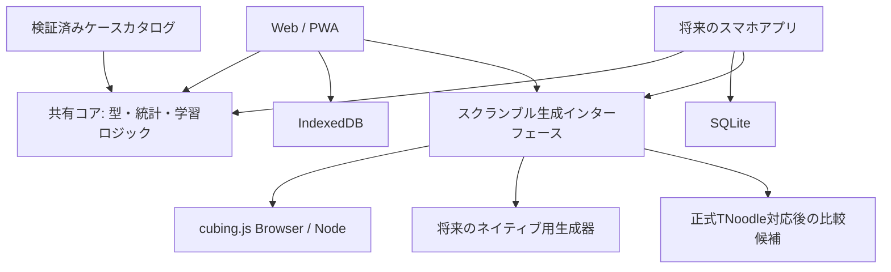

# Everyday Nautilus 開発計画

作成日：2026-09-26

### 現在の進捗：M0完了

- [x] Node 24.21.0をpnpmの`devEngines.runtime`で管理。pnpmのworkspace、ランタイム・依存バージョンとlockfileを固定。CIもpnpmでNodeを導入。
- [x] React／Viteの起動ページ、通常FTOの実生成、生成元・版の記録。
- [x] UIに依存しない共有型とAo5計算。+2／DNF等の9件のユニットテスト。
- [x] Biome、型チェック、Vitest、本番ビルドを確認。
- [x] NodeでFTO生成・パズルモデルへの適用・逆手順での復元を確認。
- [x] 本番ブラウザのPC幅／スマホ幅で生成と再生成の2件のE2Eを確認。
- [x] 開発モードの生成も確認。開発サーバーは5187、E2E専用は4187。
- [x] GitHub Actionsに静的チェック、シークレットスキャン、テスト、検証済みビルドのCloudflare WorkersへのCDを設定。[初回設定](DEPLOYMENT.md)。リモートCI/CDの実行は未確認。
- [x] actionlint、Gitleaks、Workers dry run、Workers配信での4件のE2Eをローカルで確認。削除済みのダミーの秘密情報も履歴から検出し、失敗終了とログのマスクを確認。

タイマー・永続保存・PWA・ステップ生成・ケースカタログ・暗記機能は未実装。次の作業はM1のタイマー状態機械と入力対応。

本番ビルドには生成器由来の大きな遅延チャンクの警告が残る。M3で配信量とキャッシュ範囲を確認する。スマホ幅の自動検証は実機確認の代わりにはしない。

## 1. 目標と開発順序

FTOを毎日練習できるタイマーを入口に、Nautilusメソッドのステップ練習と手順暗記を一つのアプリで支援する。Webはフル機能、スマホは計測とパズルなしの認識・想起練習を中心にする。

1. **v0.1：タイマーMVP** — 正しいFTOスクランブル、計測、保存、統計、バックアップ。
2. **v0.2：Nautilus練習** — 初中級者向けのステップ開始状態、区間計測、基本LLケース。
3. **v0.3：手順暗記** — ケース選択、認識／実行の分離、学習状態、復習キュー、パズルなしの練習。
4. **v1：学習支援とスマホ展開** — 1LLL拡充、個別復習、混同分析、ネイティブ版、端末間同期の検討。

タイマーMVPを先に完成・検証し、後続機能は同じ記録基盤に追加する。初中級者に377ケースの一括習得を求めず、少数手順 → L6X／L3C → 希望する1LLLグループの順に進める。

## 2. 確認済みの前提

- WCAはFTOを2027-01-02から公式競技に追加することとAo5の採用を発表している。FTO固有の確定規則は公開前に再確認する。[WCA発表](https://www.worldcubeassociation.org/posts/changes-to-the-wca-s-list-of-official-events-june-2026)
- 提供された入門資料はFB → Centers → Last Triple → LLを扱う。別途L6X 35／L3C 5と1LLLの377行を確認した。全件の状態検証は今後実施する。[資料確認記録](REFERENCES.md)
- 1LLLは追加指定された[日本語練習シート](https://docs.google.com/spreadsheets/d/1tjEwwDzFP1aoLKH5eCuQAzcHH9v5Xrvn0H0Kmfvme0M/edit?gid=308154264#gid=308154264)を優先する。日本語模様・推奨手順・別候補・習得・メモの列を活用し、Costを実測時間と混同しない。原表の独自定義と向きは照合する。
- 通常スクランブルはcubing.jsで開始する。TNoodleのFTO対応PRは調査時点でopen。正式採用や公式大会での使用可能性を保証する表示は行わない。[cubing.js仕様](https://js.cubing.net/cubing/scramble/)・[TNoodle PR](https://github.com/thewca/tnoodle-lib/pull/52)
- 当初はアカウント不要のローカル保存。スマホ利用はレスポンシブWeb／PWAを先行し、ネイティブはExpo／React Nativeを候補にする。

## 3. 画面とユーザー導線

| 画面 | 主な操作 | スマホでの優先度 |
| --- | --- | --- |
| タイマー | モード選択 → スクランブル → 計測 → 補正／メモ | 最優先。大きい操作面、誤タップ防止 |
| 記録・統計 | セッション、履歴、ベスト、平均、推移 | 直近記録と簡単な統計を優先 |
| ステップ練習 | 完成済み範囲を選ぶ → 対象ステップを練習 | パズルを持っている時の利用 |
| ケースライブラリ | グループ・学習状態で絞る、手順候補を選ぶ | 選択済みケースの確認を優先 |
| 今日の復習 | 期限到来・苦手ケース → 短い練習 → 評価 | パズルあり／なしを選択 |
| 認識・想起クイズ | 図で判断 → 回答 → 解説／手順表示 | パズルなしで使う中心機能 |
| 設定・データ | 持ち方、色、計測、書き出し／読み込み | バックアップと計測設定 |

## 4. v0.1：タイマーMVPの仕様

### スクランブル

- 通常FTOのランダム状態スクランブルと、検証済みの状態図。
- 生成中／失敗／再試行の表示。生成が完了するまで開始できない。
- 解いている間に次を準備し、計測中に表示中の手順が切り替わらないようにする。
- 記録には手順文字列、生成元、バージョン、生成日時、モードを含める。乱数seedに対応していない生成元では手順自体を再現の根拠にする。

### 計測

- Spaceキーの長押しで準備、離すと開始、再押下で停止。長押し時間は設定可能にする。
- タッチ操作でも同じ状態遷移。ボタンの連打・キーrepeat・pointercancel・画面離脱を考慮する。
- `idle → holding → ready → inspecting（任意）→ running → stopped`を明示的に管理する。
- 経過時間は単調増加する時計で計算する。描画頻度やsetIntervalの回数に依存させない。日付は別の時計で保存する。
- インスペクションは初期設定off、任意で15秒。8／12秒通知、15／17秒の境界をテストし、確定したWCA規則と照合する。
- スマホのバックグラウンド移行・PCのスリープ等は検出し、中断状態を表示して記録前に確認できるようにする。
- 計測中は設定変更・次スクランブルを無効化。Wake Lockは対応時のみ補助的に使用する。

### 保存・統計

- セッション作成・名前変更、ソルブ追加、+2／DNF補正、メモ、削除と取消。
- 生のミリ秒を保持し、表示時に丸める。ペナルティで元タイムを書き換えない。
- 件数、DNF率、ベスト、Mo3、Ao5、Ao12、セッション平均、直近推移。
- Ao5／Ao12は+2適用後に並べ、最速・最遅を各1件除外。DNFを最遅として扱い、残れば平均はDNF。Mo3はDNFが1件あればDNF。
- 通常ソルブ・ステップ・ケース・クイズの記録を同じ平均に混ぜない。母数不足は値を表示しない。
- IndexedDB（Dexie候補）に保存。再読み込み後も残り、保存失敗を成功表示しない。
- バージョン付きJSONの書き出し／読み込み。検証・重複処理・失敗時の原状保持を実装する。CSVは閲覧用として追加する。

### 対応品質

- PCのキーボードとスマホのタッチで使え、320px幅でも横スクロールしない。
- キーボードフォーカス、十分なコントラスト、色以外のケース識別を用意する。
- PWAとしてホーム画面に追加できる。初回オンライン読み込み後、必要なWorkerと動的chunkもキャッシュしてオフライン生成できることを確認する。
- Service Workerの更新は計測中に強制適用しない。新旧カタログ・DBの版が混ざらないようにする。
- 静的ホスティングで公開可能なビルド。公開時の利用条件・プライバシー・第三者コードの表示を用意する。

### MVPの完了条件

- [ ] 通常スクランブル → 計測 → 補正 → 保存 → 再読み込みが一貫して動く。
- [ ] タイムと手順の対応が、次の手順の先読み中にもずれない。
- [ ] Ao5／Ao12／Mo3の境界、同値、+2、DNF、件数不足を検証済み。
- [ ] 記録を別ブラウザに書き出して戻せる。
- [ ] PC・iOS Safari・Android Chromeで実機確認済み。
- [ ] オフラインの本番ビルドでスクランブル生成・保存ができる。
- [ ] 確定済み規則、ライセンス表示、公開ビルドを確認済み。

## 5. v0.2：Nautilusのステップ練習

| モード | 開始時に保つもの | 練習すること |
| --- | --- | --- |
| First Block | 通常の未完成状態。最初は色固定、後に色選択 | 最初のブロックづくり |
| Centers | First Block完成 | 残る大センターづくり |
| Last Triple | First Block・Centers完成 | 最後のトリプル、CIF→EIFの持ち替え |
| LL（2-look） | 下層完成 | L6X → L3Cのつなぎ |
| L6X | 下層完成。最後の角は許容状態を別途定義 | 最後の6三角の認識と手順 |
| L3C | 下層・L6X完成 | 最後の3角の認識と手順 |
| 1LLL | 下層完成 | 指定グループのLL全体 |

### 生成方式と正しさ

1. 標準FTO状態モデルにNautilusの完成条件を定義し、各ステップのピース集合・配色・持ち方を照合する。
2. 最初は検証済みセットアップの集合、または検証済み手順の逆から目的状態を作る。これをケースセットアップとして表示する。
3. 次に完成済み範囲を保つ制約付き状態生成を実装する。必要に応じて群・同値類・解探索を利用する。
4. 自動検証では「保つ範囲が完成」「目的ケースに属する」「到達可能」「解法で目的範囲が完成」を確認する。

単にランダムな数手を回す実装や、Bencisco用の既存モードを名称だけNautilusに変える実装は採用しない。cubing.jsにはBencisco向けのFTO表示分類もあるため、メソッドの差を確認する。

ケース指定はまず均等出題を基本とし、実戦に近い出現頻度を反映するモードは分布の根拠を検証して追加する。逆手順だけでは同じ配置を覚えやすいため、AUF・許容向き・同値ケースの変化を、完成条件を保つ範囲で加える。

### 測定・導線

- ステップ単独のタイムと、全体ソルブ中の任意の区間計測を保存する。
- 小さい基本集合からL6X 35／L3C 5へ段階的に拡張する。
- 練習対象ピースの強調、完成条件、持ち方を表示する。
- ステップ／色／ケース集合ごとに統計を分け、最も止まる区間を把握できるようにする。

完了条件：各モードで保持条件を自動検証でき、実物でもセットアップから対象ステップを練習できる。

## 6. v0.3：手順暗記の中心機能

### ケース管理

- L6X／L3C／1LLL、模様グループ、個別ケース、選択集合、苦手、復習期限で絞る。
- 自分の手順、複数の代替候補、好みの持ち方、認識メモ、タグ、お気に入りを保存する。
- 手動の「未学習／学習中／覚えた」と、測定から見える「最近の正答・保持」を別々に表示する。
- 未学習・覚えたケースを指定した出題と、学習済み手順で対応できる集合からの出題を用意する。
- 空の集合、誤ったケース指定、未検証セットアップからは出題しない。

### 練習モード

| モード | 測る項目 | パズル |
| --- | --- | --- |
| 認識クイズ | ケース図表示 → ケース／グループ回答、正誤、反応時間、混同先 | 不要 |
| 手順想起 | ケース図表示 → 回答／答え表示、想起時間、自己評価、ヒント使用 | 不要 |
| 実行反復 | セットアップ後、開始 → 停止、実行時間、ミス箇所 | 必要 |
| 認識＋実行 | 認識開始 → 判断済み操作 → 実行終了、各区間、合計 | 必要 |
| 実戦ミックス | 複数ケースを予告せず出題、次の判断まで含めて測定 | 必要 |

測定開始は図が描画された後。実物ではセットアップ後に本人が判断開始を指示し、セットアップ時間を混ぜない。スマートFTOを使わない初期版では回転開始を自動検出できないので、判断済み操作を明示的に行う。

実行タイムだけから「覚えていない」と推定しない。パズルなしの自己評価は、物理的に回した時の成功と区別する。

### ケースごとの記録・分析

- 試行数、正答率、初回正答率、ヒント率、ミス、認識時間と実行時間の中央値／ばらつき。
- 認識が遅い、実行が遅い、忘れた、似たケースと混同した、を別々に表示する。
- 少数試行では断定しない。測定条件と母数を表示する。
- 自分の過去成績や同じケース・同じ手順候補で比較し、長い手順を一律に苦手扱いしない。
- 手順候補を変更した場合は実行成績を候補別に分ける。過去履歴は残す。
- 準備済みの短い練習セッションと、対象を自由に選ぶ練習の両方を用意する。

### 間隔反復とフィードバック

- 答えを先に見せず想起する。回答後に正しいケース・手順・見分け方を提示する。
- 期限到来、最近の誤答、未学習を組み合わせ、なぜ出題されたか分かる復習キューを作る。
- 新規ケース数、セッション時間、反復上限を調整可能にし、苦手だけが際限なく続くことを防ぐ。
- 初学者は少数ケースの集中反復、習熟後は似たケースの識別と混合練習へ進む。
- 認識／想起／実行は別の学習状態を持つ。FSRSは主に想起用スケジューラの候補とし、実行速度にそのまま適用しない。
- 評価は再試行／難しい／良い／簡単などの定義を示す。誤答、ヒント、自己申告を保存し、後で再計算できるようにする。

練習テスト・分散学習には研究上の支持がある。FTOへの適用、具体的な間隔、苦手判定は本アプリで検証する仮説とし、短期の速度だけで学習効果を判断しない。[Roediger & Karpicke, 2006](https://www.psychologicalscience.org/journals/psychological-science/j.1467-9280.2006.01693.x/)・[Dunlosky et al., 2013](https://www.psychologicalscience.org/publications/journals/pspi/learning-techniques.html)

完了条件：選択集合での出題、正誤と二つの時間、学習状態、翌日以降の復習、パズルなしの認識・想起が一つの導線で使える。

## 7. スマホ版の方針

### PWAを先行

タイマーMVPでタッチ操作・オフライン・ホーム画面追加を整える。手順暗記段階では、短時間の認識クイズ・想起カード・今日の復習をスマホ向け導線に追加する。

### ネイティブ版

Expo／React Nativeを候補とし、次の技術確認後に`apps/mobile`を追加する。

- 計測時計、バックグラウンド移行、触覚、画面点灯維持。
- SQLite保存と、Webとの同じ記録・カタログ形式。
- cubing.jsのWeb Workerはネイティブにそのまま移植できると仮定しない。ローカル生成可能なアダプター／バンドルしたWebView等を小さく比較し、オフライン生成と起動性能を確認する。
- FTOの図・アニメーションの負荷、入力・アクセシビリティ。
- アカウント・同期を追加する場合の競合、削除、タイムゾーン、端末移行。

ネイティブ初期版の範囲はタイマー、直近統計、認識・想起、復習。細かいカタログ編集・高度な分析はWebで先行する。

## 8. 技術構成と境界

| 領域 | 初期採用／候補 | 理由 |
| --- | --- | --- |
| 開発基盤 | Node 24 LTS、pnpm workspace、TypeScript | Webと将来のスマホでドメインロジックを共有 |
| Web | React、Vite | ブラウザ中心・静的配信、サーバー不要で開始 |
| FTO | cubing.jsをアダプター経由で利用 | 既存生成器・状態モデルを利用し、差し替え可能にする |
| ローカル保存 | IndexedDB／Dexie候補 | オフラインとマイグレーション |
| PWA | Service Worker。プラグインはWorker配信の検証後に選定 | 動的chunkと生成器のキャッシュが必要 |
| 学習スケジューラ | ts-fsrs候補 | 独自に記憶モデルを発明せず、イベントから再計算 |
| 品質確認 | Biome、Vitest、Playwright、GitHub Actions | 計測・統計・実Worker・タッチ操作を確認 |
| 公開 | Cloudflare Workers Static Assets、Wrangler、GitHub Actions | 検証済みの同じ成果物をCI成功後に配信 |
| スマホ | Expo／React Native候補 | 共有コア＋端末別UI／保存／生成アダプター |

`packages/core`にはDOM、React、IndexedDB、ネイティブAPIを持ち込まない。`packages/scrambler`は現時点でBrowser／Node用。保存・時計・入力・描画・同期は各プラットフォームのアダプターにする。

バックエンド、認証、課金、スマートパズル連携はMVPの依存にしない。Webの公開先はCloudflare Workers Static Assetsを採用し、GitHub ActionsのCI成功後にCDで公開する。初期はworkers.devを使用し、独自ドメインは別途選定する。

## 9. 記録とケースのデータ設計

| データ | 主な項目 |
| --- | --- |
| Session | ID、名前、モード、作成日時、設定 |
| Scramble | ID、手順、生成元・版、日時、モード、将来のcase ID・向き・カタログ版 |
| Solve | ID、session ID、Scramble、元タイム、ペナルティ、日時、メモ、任意の区間 |
| AlgorithmCase | 安定case ID、集合、グループ、状態、認識図、AUF、向き、出典、カタログ版 |
| AlgorithmVariant | case ID、variant ID、元の記法、正規化した手順、持ち替え、注記、出典 |
| CaseProgress | case ID、手動の学習状態、選択variant、認識・想起・実行別の進捗 |
| PracticeAttempt | case／variant／catalog版、出題状態、モード、判断／想起／実行時間、正誤、回答case、ヒント、自己評価 |
| ReviewEvent | 対象技能、評価、評価日時、スケジューラ版、前後状態、次回期限 |
| Settings | 色・向き、入力、検査時間、表示、練習時間、新規上限 |

初期のSolve／Scramble型は作成済み。ケース関連は正規化調査後に実装する。時刻はUTCで保存し、表示と「今日の復習」は利用者のタイムゾーンで判定する。DB版・カタログ版・バックアップ形式版を分ける。

元のケースカタログと個人の編集・記録を分離し、カタログ更新でメモや学習状態を失わないようにする。将来の同期に備えIDを生成するが、現時点では端末間の自動同期は提供しない。

## 10. 実装マイルストーン

期間は1人で集中開発する場合の初期目安。資料検証と実機確認で更新し、納期の約束として扱わない。

| 段階 | 内容 | 目安 | 出口 |
| --- | --- | --- | --- |
| M0：今回 | workspace、起動ページ、生成アダプター、型、検証環境、計画 | 今回 | 依存導入・起動・本番ビルド・実FTO生成の確認 |
| M1 | 計測状態遷移、PC／タッチ、通常スクランブルとの結合 | 3–5開発日 | タイムと手順を正しく結びつける |
| M2 | 保存、補正、セッション、統計、書き出し／読み込み | 4–6開発日 | ブラウザを閉じても記録を失わない |
| M3 | 状態図、PWA、実機・オフライン、公開準備 | 3–5開発日 | v0.1の完了条件を満たす |
| M4 | FTO記法／向きの正規化、基本ケースと保持条件、ステップ生成 | 7–12開発日 | v0.2の完了条件を満たす |
| M5 | ケース選択・進捗・認識／実行・想起・復習 | 7–12開発日 | v0.3の完了条件を満たす |
| M6 | 1LLL全件検証、混同分析、学習効果測定、改善 | 別見積もり | 状態検証済みカタログと保持評価 |
| M7 | ネイティブ技術検証・スマホ版・同期要否決定 | 別見積もり | 実機でオフライン計測とパズルなし復習 |

### 次の着手順

1. 入力から独立したタイマー状態機械と時計インターフェース。
2. キーボード／タッチ入力を接続し、実スクランブルを記録へ固定。
3. IndexedDB保存と読み戻し。
4. +2／DNF、Ao5／Ao12／Mo3、履歴とセッション。
5. バックアップ、FTO状態図、PWA、実機確認。

## 11. 検証方針

- ユニット：状態遷移、計測時計、ペナルティ、平均、出題対象、保持条件、ケース正規化、復習期限。
- 統合：DBマイグレーション・保存失敗・バックアップ読込・カタログ更新時の個人データ保持。
- ブラウザ：本番Worker、キーボードrepeat、タッチcancel、連打、画面離脱、オフライン、更新通知、レイアウト。
- FTO：生成手順の適用／逆操作、ケースセットアップ＋解法、ステップ完成条件、AUF／持ち替えの照合。
- 実機：iOS Safari／Android Chromeのタッチ・スリープ・保存・ホーム画面起動。
- 学習：同日速度に加え翌日・1週間後の正答率、認識時間、実戦での停止、継続状況を確認する。評価機能の送信は本人の同意を得た場合だけ行う。

ランダム状態の分布品質は少数の生成テストでは証明できない。既存生成器の根拠・実装・更新履歴を確認し、公式生成器との比較時にも区別する。

## 12. リスクと未決事項

| 項目 | 対応 |
| --- | --- |
| 2027規則・正式スクランブラーの変更 | 調査日を残し、公開前に再確認。生成元と版を記録 |
| CIF／EIF・独自定義と標準FTOの差 | 記法変換表と状態検証をM4の前提にする |
| ケース数・手順品質・画像の取得 | 全件検証。図は検証済み状態から生成し、未検証を区別 |
| 公式性・転載・帰属 | 練習用の表示、利用条件確認、第三者ライセンス文書 |
| 初回生成・バンドルサイズ・スマホ発熱 | 遅延読込と先読みを計測。復習中は不要な生成を停止 |
| ブラウザ保存の消去・容量制限 | 書き出し導線、保存エラー表示、後の同期を検討 |
| 自己評価の偏り | 実測の正誤・時間と手動学習状態を分離 |
| 心理学知見のFTOへの転移 | 保持と実戦成績で検証。効果の数値を推測して表示しない |
| スマホの生成器・描画の互換性 | Expo採用前に小さい技術検証。UIの全共有を前提にしない |

未決事項は公開先、配色と既定の持ち方、記録の同期、ネイティブ提供時期、公開カタログの利用条件。MVPの開発はローカル保存・日本語UI・通常FTO生成で開始できる。
